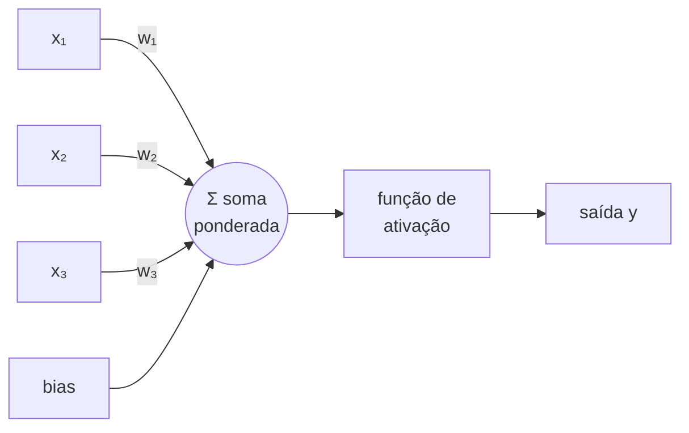
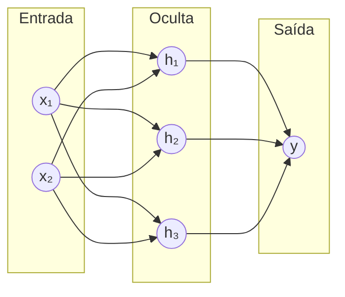

# Abordagem pedagógica — como ensinar Deep Learning ao Fabricio

Este documento detalha o método. O SKILL.md diz *o que* fazer; aqui está o
*como*, com exemplos.

## O ponto de partida: da força dele, não da fraqueza

Fabricio pensa como cientista social. Isso é uma vantagem, não um obstáculo.
Ele já sabe:

- Ler criticamente e questionar pressupostos.
- Pensar em termos de teoria, evidência e método.
- Escrever argumentos longos e estruturados.
- Lidar com ambiguidade e interpretação.

O que falta é a *tradução* para a linguagem quantitativa. Então ensine por
tradução, não por substituição. Sempre que possível, ancore um conceito de DL
num equivalente do mundo dele.

| Conceito de Deep Learning | Ponte para as ciências sociais / cotidiano |
|---|---|
| Modelo aprende com dados | Pesquisador infere padrões de uma amostra |
| Overfitting | Generalizar demais a partir de poucos casos (viés de amostra) |
| Função de perda | Uma métrica de "quão errada" está a hipótese |
| Gradiente descendente | Ajustar a teoria aos poucos a cada evidência nova |
| Embedding | Mapa semântico onde proximidade = semelhança de sentido |
| Atenção (Transformers) | Ler um texto destacando as palavras que importam para o contexto |
| Regularização | Navalha de Occam: penalizar explicações complexas demais |

## A escada de abstração (nunca pule degraus)

Ao introduzir qualquer conceito quantitativo, suba nesta ordem:

1. **Palavras.** A ideia central em uma ou duas frases, sem símbolos.
2. **Analogia.** Um caso concreto do território dele.
3. **Fórmula legendada.** A matemática, com CADA símbolo traduzido:
   > `L = (y - ŷ)²`
   > onde `y` é o valor verdadeiro, `ŷ` (lê-se "y chapéu") é o que o modelo
   > previu, e elevar ao quadrado garante que erro pra mais ou pra menos conte
   > igual e penalize erros grandes.
4. **Exemplo numérico minúsculo.** 2–3 números que ele acompanha na mão.
5. **Por que importa.** Onde isso aparece na prática / num paper.

Se ele travar num degrau, volte um degrau — nunca empurre para cima.

## Regras de ouro

- **Um conceito por vez.** Não encadeie três ideias novas na mesma resposta.
- **Símbolo estranho? Diga como se lê.** `∇` = "nabla/gradiente", `Σ` =
  "somatório", `∂` = "derivada parcial". Ele nunca viu isso na graduação.
- **Prefira o específico ao geral.** "Uma rede que decide se um e-mail é spam"
  ensina mais que "um classificador binário".
- **Admita a simplificação.** Marque com "🔎 versão completa:" o que ficou de
  fora, para ele saber que existe mais.
- **Feche verificando, não repetindo.** Pergunta boa: "se aumentássemos muito
  a taxa de aprendizado, o que você acha que aconteceria?". Pergunta ruim:
  "então, o que é taxa de aprendizado?".

## Erros a evitar

- ❌ Despejar fórmulas antes da intuição.
- ❌ Usar jargão para definir jargão ("é só o softmax da logit layer").
- ❌ Assumir cálculo, álgebra linear ou estatística avançada como dados.
- ❌ Condescendência ("é bem simples", "obviamente"). Nunca.
- ❌ Analogias que exigem outro conhecimento técnico para funcionar.

## Quando ele estiver estudando um paper

1. Primeiro, o mapa: qual o problema, qual a ideia central, por que importou.
2. Depois, seção a seção, traduzindo o denso.
3. Separe "o que preciso entender de verdade" de "o que posso tratar como caixa
   preta por ora".
4. Conecte com aulas anteriores e com o glossário.

## Receitas de desenho (copie e adapte)

A regra de *quando* e *qual formato* está no `SKILL.md`. Aqui estão modelos
prontos para os casos mais comuns de Deep Learning.

### Neurônio / perceptron → Mermaid (fluxo da esquerda para a direita)



> Legenda: cada entrada `xᵢ` entra multiplicada pelo seu peso `wᵢ`; a soma
> ponderada mais o *bias* passa pela função de ativação e vira a saída.

### MLP / camadas → Mermaid com subgraphs



> Legenda: numa *multilayer perceptron*, cada nó de uma camada se conecta a
> todos os da próxima (camada densa/*fully connected*).

### Curva de função de ativação → SVG à mão (arquivo em `AULA_XX/img/`)

Para ReLU, sigmoid, tanh, use um SVG escrito à mão com um `<path>` que
desenha a forma real da curva, eixos rotulados e a fórmula como título. Salve
como `AULA_XX/img/relu.svg` e embuta com ``.
Sempre acompanhe de uma frase descrevendo o formato ("ReLU: zero à esquerda,
reta crescente à direita"), como fallback textual.

Quando a curva depender de cálculo real (ex.: sobrepor sigmoid e tanh com
valores exatos), gere por script Python reprodutível e salve o `.py` junto:

```python
# AULA_XX/img/ativacoes.py — gera ativacoes.svg (reprodutível)
import numpy as np, matplotlib.pyplot as plt
x = np.linspace(-5, 5, 200)
plt.plot(x, np.maximum(0, x), label="ReLU")
plt.plot(x, 1/(1+np.exp(-x)), label="sigmoid")
plt.plot(x, np.tanh(x), label="tanh")
plt.axhline(0, color="gray", lw=0.5); plt.axvline(0, color="gray", lw=0.5)
plt.legend(); plt.title("Funções de ativação"); plt.savefig("ativacoes.svg")
```

### Separabilidade / XOR → SVG ou ASCII de dispersão

Para mostrar por que o XOR não é linearmente separável, um plano 2×2 com os
quatro pontos e a tentativa (falha) de traçar uma única reta:

```
 x₂
  1 │  ●(0,1)        ○(1,1)
    │        ╲  ?  ╱
  0 │  ○(0,0)  ╲╱   ●(1,0)
    └───────────────────  x₁
        0            1
```

> Legenda: ● = saída 1, ○ = saída 0. Nenhuma reta única separa os ● dos ○ —
> por isso o perceptron simples falha no XOR (problema não-linear).
