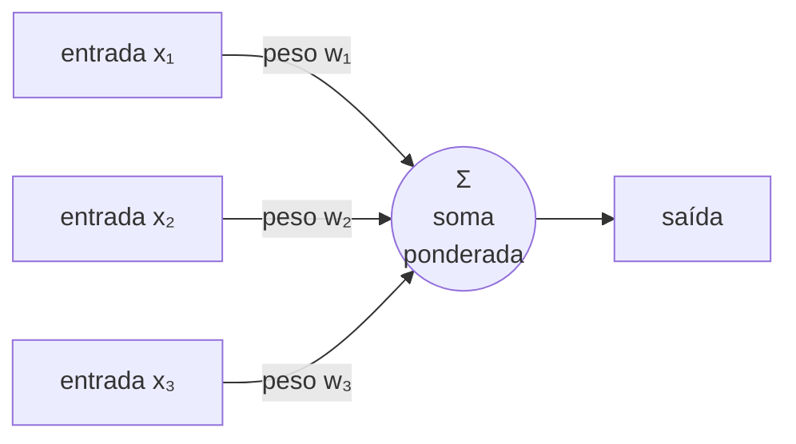
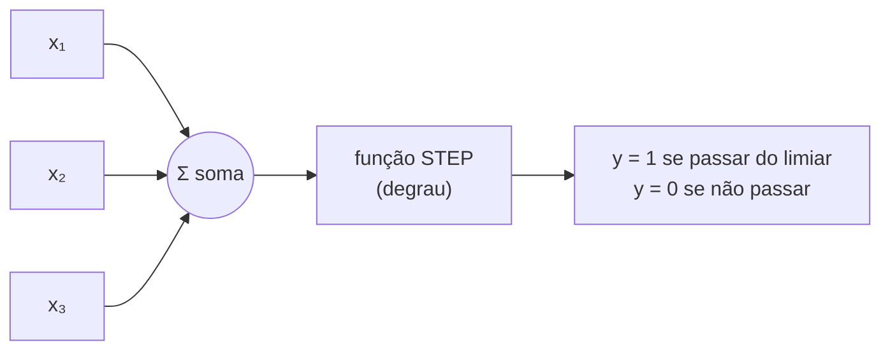
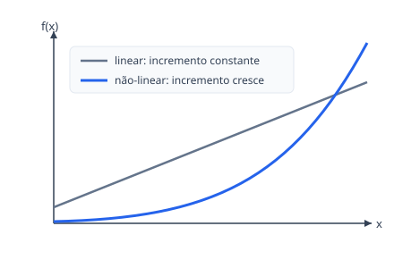
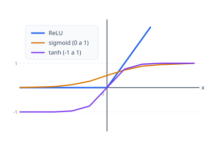
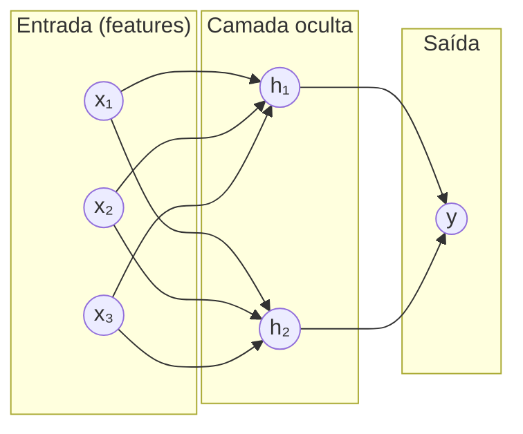

# Aula 01 — De um neurônio à rede neural

> Caderno de estudos construído a partir das suas anotações em `TEORIA.txt`.
> As anotações originais estão preservadas naquele arquivo; este aqui é a
> versão trabalhada, para reler e estudar. As figuras estão em `img/`.

## 🎯 Objetivo da aula

Sair do zero absoluto e chegar à ideia de **rede neural**: entender o que é
Deep Learning, conhecer o **neurônio artificial** e sua evolução histórica (o
**perceptron**), descobrir por que um neurônio sozinho falha (o **XOR**), e ver
como as **funções de ativação** e o empilhamento em **camadas (MLP)** resolvem
isso.

---

## 1. O que é Deep Learning

**A ideia em uma frase:** são modelos de **redes neurais** com muitas camadas
de "neurônios artificiais" empilhadas — dezenas, centenas — e um número enorme
de peças ajustáveis (milhões ou até bilhões).

**A palavra "profundo" (deep)** não é sobre dificuldade: é literalmente sobre
*profundidade*, no sentido de **muitas camadas empilhadas**, uma alimentando a
próxima. Quanto mais camadas, mais "fundo" o modelo.

> 🌉 **Analogia (do seu território):** pense numa revisão de literatura feita
> por várias mãos em sequência. Um leitor lê os artigos crus e escreve um
> fichamento; outro agrupa os fichamentos por tema; um terceiro escreve a
> síntese. Cada camada trabalha sobre o resultado da anterior e enxerga um
> padrão mais abstrato.

---

## 2. Onde o Deep Learning se encaixa: IA, ML, DL e Gen AI

Os "níveis" de inteligência artificial são **círculos concêntricos** — cada um
está *dentro* do anterior, é um caso mais especializado:

```
┌─────────────────────────────────────────────┐
│ Inteligência Artificial (IA)                 │
│  ┌─────────────────────────────────────────┐ │
│  │ Machine Learning (ML)                    │ │
│  │  ┌─────────────────────────────────────┐ │ │
│  │  │ Deep Learning (DL)                  │ │ │
│  │  │  ┌───────────────────────────────┐  │ │ │
│  │  │  │ IA Generativa (Gen AI)        │  │ │ │
│  │  │  └───────────────────────────────┘  │ │ │
│  │  └─────────────────────────────────────┘ │ │
│  └─────────────────────────────────────────┘ │
└─────────────────────────────────────────────┘
```

- **IA** — o círculo maior; na forma básica, regras **`SE… ENTÃO…`** (if/else)
  escritas por uma pessoa.
- **Machine Learning** — a máquina **aprende as regras a partir de exemplos
  rotulados** (os *labels*).
- **Deep Learning** — além das regras, o modelo **descobre sozinho quais
  características (descritores) olhar**.
- **IA Generativa (Gen AI)** — o círculo mais interno: **produz conteúdo novo**
  (texto, imagem, áudio) a partir dos padrões aprendidos.

**A ideia-chave:** a cada nível, mais decisão passa da pessoa para a máquina —
das regras (IA→ML), depois das características (ML→DL), até a criação de conteúdo
(DL→Gen AI).

---

## 3. A virada da visão computacional (~2011)

**Antes (até ~2011):** para o computador reconhecer imagens, um humano
**extraía as características na mão** — cores, texturas, **histogramas** (contagem
de pixels por tom) — e as entregava a um classificador clássico de ML (**SVM,
Random Forest, XGBoost** — trate-os como caixas-pretas por ora).

**Depois:** o **Deep Learning** inverte isso — a própria rede **aprende a extrair
as características** a partir dos pixels crus. É a família das **CNNs** (redes
convolucionais) e dos ***Vision Transformers***, treinadas com **backpropagation**
(o motor que ajusta os pesos; veremos adiante).

> 🌉 **Analogia:** é a diferença entre montar o livro de códigos à mão (decidir
> de antemão o que medir em cada texto) e deixar o método **descobrir sozinho as
> dimensões que importam** a partir do corpus rotulado.

---

## 4. O neurônio artificial

O neurônio é a unidade de processamento: **recebe várias entradas, dá um peso a
cada uma, soma tudo e produz uma saída.**



> Legenda (fallback textual): cada entrada `xᵢ` entra multiplicada pelo seu peso
> `wᵢ`; o neurônio soma tudo e isso vira a saída.

> 🌉 **Analogia:** é a **nota final por média ponderada**. A prova pesa mais
> (peso alto), o trabalho pesa menos. Multiplica cada nota pelo peso, soma, e
> chega na final.

### Exemplo numérico (acompanhe na mão)

| Entrada | Valor | Peso |
|---------|-------|------|
| x₁      | 2     | 0,5  |
| x₂      | 3     | 1,0  |
| x₃      | 1     | 2,0  |

```
saída = (2 × 0,5) + (3 × 1,0) + (1 × 2,0) = 1,0 + 3,0 + 2,0 = 6,0
```

Repare: x₃, mesmo com o menor valor (1), pesou mais no resultado, porque seu
peso era o maior. **É o peso que decide a importância, não o tamanho da
entrada.**

---

## 5. O Perceptron: o primeiro neurônio "treinável"

O **perceptron** (anos 1950–60) é o neurônio clássico com um detalhe a mais no
fim: depois da soma, o valor passa por uma **função STEP (degrau)**, que decide
uma resposta **binária**:



- **Limiar (threshold):** o ponto de corte. Se a soma o ultrapassa, `y = 1`;
  senão, `y = 0`.
- **Função STEP (degrau):** só tem dois valores possíveis (0 ou 1) — como um
  interruptor liga/desliga.

> 🌉 **Analogia:** é uma **decisão de aprovação por nota de corte**: somou os
> pontos, passou de 6,0 → aprovado (1); não passou → reprovado (0). Não existe
> "meio aprovado".

---

## 6. O problema do XOR e o "inverno da IA"

Aqui está a falha histórica do perceptron. Ele só consegue separar dados que
uma **única linha reta** divide (problemas *linearmente separáveis*). O **XOR**
("ou-exclusivo") não é assim:

```
 x₂
  1 │  ●(0,1)              ○(1,1)
    │          ╲    ?    ╱
    │           ╲       ╱
  0 │  ○(0,0)    ╲     ╱   ●(1,0)
    └──────────────────────────  x₁
        0                    1
```

> Legenda (fallback textual): ● = saída 1, ○ = saída 0. **Nenhuma reta única**
> separa os ● dos ○ — sempre sobra um ponto do lado errado. Por isso o
> perceptron simples falha no XOR: é um **problema não-linear**.

**A consequência histórica:** se um único neurônio nem o XOR resolve, como
resolveria problemas complexos? Essa constatação (anos 1960) esfriou a área — o
chamado **"inverno da IA"**. Só cerca de **20 anos depois (~1974)** veio o
**backpropagation**, o método que reativou o Deep Learning. E a saída para o
XOR foi dupla: **(1)** trocar a função STEP por uma **função não-linear** e
**(2)** encadear vários neurônios em **camadas** (o que veremos no item 9).

---

## 7. Do degrau à curva: funções não-lineares

O STEP é "duro demais" — só dá 0 ou 1 e não ajuda a rede a aprender nuances.
A solução foi trocá-lo por uma **função não-linear**.

**O que é "não-linear"?** Numa função **linear**, um passo em `x` gera sempre o
*mesmo* passo em `y` (se `f(x)=y`, então `f(x+1)=y+2`, `f(x+2)=y+4`… incremento
constante → uma reta). Numa função **não-linear**, o incremento **muda** conforme
`x` — o gráfico deixa de ser reta e **encurva**:



> Legenda (fallback textual): a reta cinza sobe sempre na mesma inclinação; a
> curva azul sobe cada vez mais rápido. Essa "curvatura" é o que dá à rede a
> capacidade de modelar relações que uma reta não captura.

---

## 8. Funções de ativação: ReLU, sigmoid, tanh, softmax

A função não-linear que fica no fim do neurônio chama-se **função de ativação**
— ela decide *se e quanto* o neurônio "dispara". As principais vistas na aula:



> Legenda (fallback textual): **ReLU** é zero à esquerda e uma reta crescente à
> direita; **sigmoid** é um "S" espremido entre 0 e 1; **tanh** é o mesmo "S",
> mas entre −1 e 1.

| Função | Onde se usa | Detalhe-chave |
|---|---|---|
| **ReLU** | camadas **intermediárias** (as do meio) | linear quando positivo, zero quando negativo; derivada barata de calcular. Não é "a melhor" universal, mas suas variações são as que melhor funcionam no meio da rede. |
| **sigmoid** σ(x) | **última** camada em **classificação binária** | espreme a saída para o intervalo (0, 1) — vira uma "probabilidade". |
| **softmax** | **última** camada em **multiclasse** | distribui a decisão entre várias classes (soma 1). |
| **tanh** | **redes recorrentes** (RNN etc.) | forma parecida com a sigmoid, mas vai de **−1 a 1**; eficiente quando o sinal negativo importa (ex.: sensores). |

> 🔎 **Versão completa:** RNNs, CNNs e o cálculo da derivada (peça central do
> backpropagation) são temas de aulas futuras. Aqui basta saber *qual função
> usar onde* e por quê a curva importa.

---

## 9. A rede completa: Multilayer Perceptron (MLP)

Um neurônio não basta. A ideia da **MLP (multilayer perceptron)** é **combinar
vários perceptrons em camadas**, inspirada na ideia de que nossos neurônios
biológicos também são interconectados. Numa MLP **densa** (*fully connected*),
**cada neurônio de uma camada se conecta a todos os da próxima**:



> Legenda (fallback textual): cada **feature** (característica) é uma entrada;
> cada seta é uma **conexão com seu próprio peso**. Toda a camada anterior
> alimenta cada neurônio da seguinte.

**Por que cada conexão tem um peso próprio?** Porque a mesma informação pode
importar de formas diferentes para cada neurônio — como pessoas diferentes
reagem de formas diferentes ao mesmo estímulo. Daí a conta base de cada conexão:
`entrada × peso` → `xₙ · wₙ` (a convenção internacional usa **W**, de *weight*).

---

## 10. Pesos e bias: a equação de cada neurônio

Com um peso só, um neurônio faz `y = W · x` — quase uma **regressão linear**.
Exemplo: se `x = -1, 0, 1, 2, 3` e `W = 0,5`, então `y = -0,5, 0, 0,5, 1, 1,5`.
Graficamente é uma reta — e repare: **ela é obrigada a passar pelo ponto zero**
(quando `x=0`, `y=0`).

Isso é uma limitação. Para a reta poder "subir ou descer" livremente, sem
depender só dos dados, adiciona-se um número extra e totalmente aprendível: o
**bias** (viés), a "variável independente".

- O **peso** muda a **inclinação** da reta.
- O **bias** muda a **altura** — define em que ponto ela cruza o eixo `y`.

> 🌉 **Analogia:** o peso é o *ângulo* de uma rampa; o bias é a *altura* em que
> a rampa começa. Sem o bias, toda rampa seria obrigada a partir do chão (do
> zero).

A conta completa de um neurônio com 4 entradas fica:

```
saída = (x₀·W₀) + (x₁·W₁) + (x₂·W₂) + (x₃·W₃) + bias
```

E, no lugar da antiga função STEP, o resultado passa agora pela **ReLU** (ou
outra ativação). Há ainda **técnicas de regularização** para controlar os pesos
— tema para mais adiante.

---

## 11. Contando os parâmetros treináveis

No neurônio acima há **5 números que a rede aprende**: `W₀, W₁, W₂, W₃` e o
`bias`. Generalizando para uma camada:

```
parâmetros treináveis = (nº de neurônios × nº de entradas) + nº de bias
```

Isso é **uma** camada. Numa rede *multi-layer*, some as camadas — e o número de
neurônios pode variar de uma para outra. É daí que vêm os "milhões/bilhões de
parâmetros" do item 1.

> ✍️ **Confira na mão:** uma camada com **3 neurônios** e **4 entradas** tem
> `(3 × 4) + 3 = 15` parâmetros treináveis (12 pesos + 3 bias).

---

## 12. Respondendo sua pergunta: o que a função não-linear faz pela rede?

> *"Mas o que a função não-linear faz com que a rede neural funcione?"* (sua
> anotação, linha 84)

**Resposta curta:** é ela que dá à rede o poder de aprender relações
**complexas** — como o XOR — que nenhuma reta resolve.

**Por quê, com intuição:** empilhar camadas *lineares* não adianta nada. Se cada
camada só faz contas de reta (`W·x + bias`), juntar várias **ainda dá uma reta**
— matematicamente, a combinação de funções lineares é outra função linear. Seria
como sobrepor várias réguas: por mais réguas que você use, nunca desenha uma
curva.

A **função de ativação não-linear** entre as camadas é o que **"entorta"** o que
cada camada produz. Com essas curvas empilhadas, a rede passa a **dobrar o
espaço** e traçar fronteiras que não são retas — e assim consegue separar o que
o perceptron sozinho não separava (o XOR do item 6).

> 🌉 **Analogia:** camadas lineares são réguas; a não-linearidade é a
> **articulação** que deixa você dobrar a régua. Só depois de poder dobrar é que
> você contorna um obstáculo que uma reta rígida não contornaria.

> 🔎 **Versão completa:** a demonstração formal (e como o backpropagation ajusta
> tudo isso via derivadas) fica para as próximas aulas. A intuição do "só o
> não-linear permite curvar" já basta para entender *por que* ele é essencial.

---

## 🧠 Para lembrar

- **Deep Learning** = redes neurais com **muitas camadas** empilhadas (*profundo*
  = muitas camadas, não "difícil").
- **Hierarquia:** IA (regras) ⊃ ML (aprende de exemplos **rotulados**) ⊃ DL
  (descobre **descritores** sozinho) ⊃ Gen AI (cria conteúdo **novo**).
- **Neurônio** = entradas × **pesos**, somados → saída (média ponderada). É o
  **peso** que define a importância.
- **Perceptron** = neurônio + função **STEP** → resposta binária (0/1) por um
  **limiar**.
- **XOR** = problema **não-linear** que uma reta não separa → mostrou o limite do
  perceptron e gerou o **"inverno da IA"**; o **backpropagation** (~1974) reativou
  a área.
- **Função de ativação** (não-linear) substitui o STEP: **ReLU** (camadas do
  meio), **sigmoid** (binária, saída), **softmax** (multiclasse), **tanh**
  (recorrentes, −1 a 1).
- **MLP** = perceptrons em **camadas**, cada conexão com seu **peso** (`x·W`).
- **Bias** = número aprendível que muda a **altura** da reta (peso muda a
  **inclinação**); sem ele, tudo passa pelo zero.
- **Parâmetros treináveis** por camada = `(neurônios × entradas) + bias`.
- **A não-linearidade** é o que permite empilhar camadas com efeito real: sem
  ela, mil camadas ainda dariam uma reta.

## ❓ Para testar seu entendimento

Uma camada tem **5 neurônios** e recebe **3 entradas**. Quantos **parâmetros
treináveis** ela tem? *(Dica: use a fórmula do item 11 e não esqueça os bias.)*
